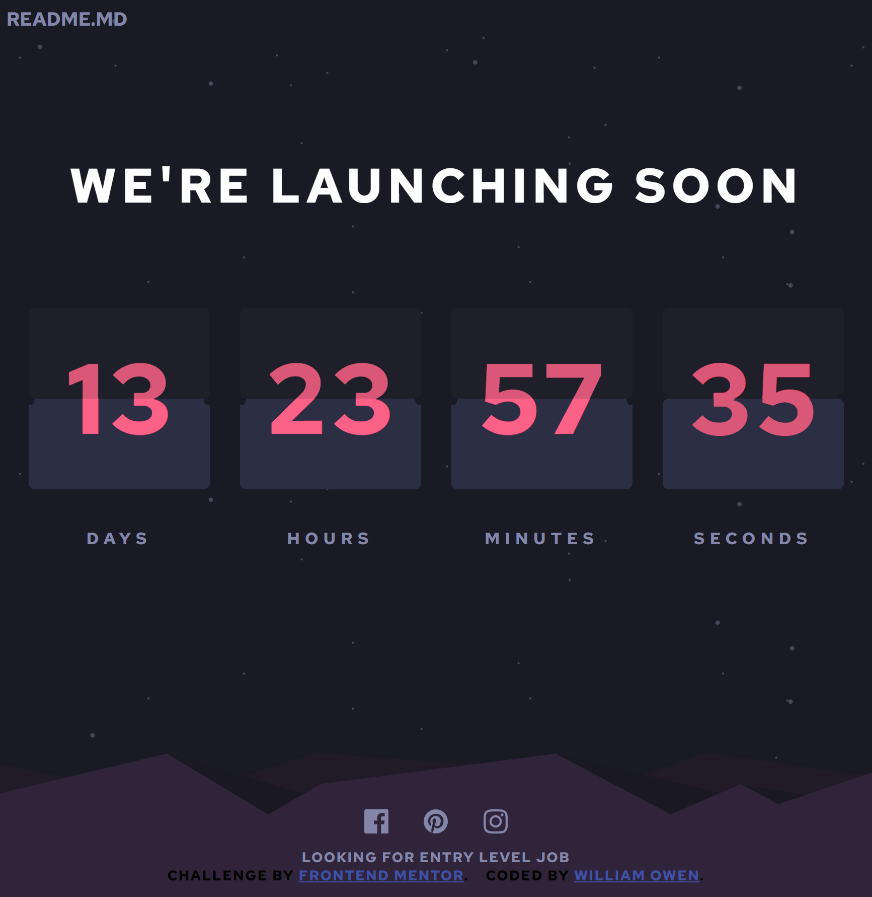

# Frontend Mentor - Launch countdown timer solution

<br>

This is a solution to the [Launch countdown timer challenge on Frontend Mentor](https://www.frontendmentor.io/challenges/launch-countdown-timer-N0XkGfyz-). Frontend Mentor challenges help you improve your coding skills by building realistic projects. 

<br>
<br>

## Table of contents

- [Frontend Mentor - Launch countdown timer solution](#frontend-mentor---launch-countdown-timer-solution)
  - [Table of contents](#table-of-contents)
  - [Overview](#overview)
    - [The challenge](#the-challenge)
    - [Screenshot](#screenshot)
    - [Links](#links)
  - [My process](#my-process)
    - [Built with](#built-with)
    - [What I learned](#what-i-learned)
  - [Author](#author)

<br>
<br>

## Overview

### The challenge

Users should be able to:

- See hover states for all interactive elements on the page
- See a live countdown timer that ticks down every second (start the count at 14 days)
- **Bonus**: When a number changes, make the card flip from the middle

<br>
<br>

### Screenshot

<!--  -->


### Links

- Solution URL: [Add solution URL here](https://your-solution-url.com)
- Live Site URL: [Add live site URL here](https://your-live-site-url.com)

<br>
<br>

## My process

### Built with

- Semantic HTML5 markup
- CSS custom properties/SASS
- Flexbox
- TypeScript
- Luxon (DateTime)
- OOP

### What I learned

I learned how to use the css 'rem' unit along side media queries on the root element's font size. Turns out to be effective and easy way to control a bunch of sizes at once.

To create a proper flip, each box has **four** flaps, each with a number on it. Three for the top and one for the bottom.

```html
// My HTML before OOP takes control

<div class="countdown">
      <div class="container">
        <div class="box days"></div>
        <div class="label">days</div>
      </div>
      <div class="container">
        <div class="box hours"></div>
        <div class="label">hours</div>
      </div>
      <div class="container">
        <div class="box minutes"></div>
        <div class="label">minutes</div>
      </div>
      <div class="container">
        <div class="box seconds"></div>
        <div class="label">seconds</div>
      </div>
    </div>
```
```css
 // the css trick to get a flip 

  animation: rotate3d 1s forwards;
  @keyframes rotate3d{
    from{transform:rotate3d(0)}
    to{
      transform:rotate3d(1,0,0,-180deg);
    }
  }
```
```js
// index.js

import Box from "./objects/box";

new Box('days')
new Box('hours')
new Box('minutes')
new Box('seconds')
```

## Author

- Website - [William Owen](https://web-dev-portfolio-react.web.app/)
- Frontend Mentor - [@williamowen65](https://www.frontendmentor.io/profile/williamowen65)
- LinkedIn - [@webdevpreneur29](https://www.linkedin.com/in/webdevpreneur29/)

